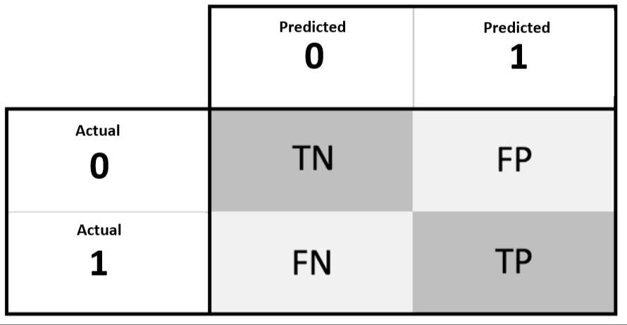
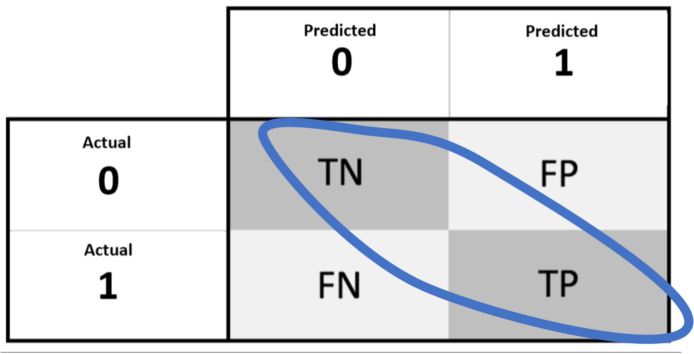
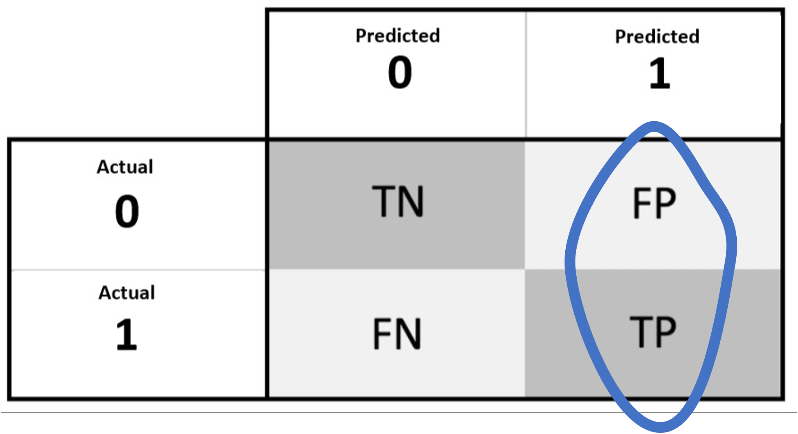
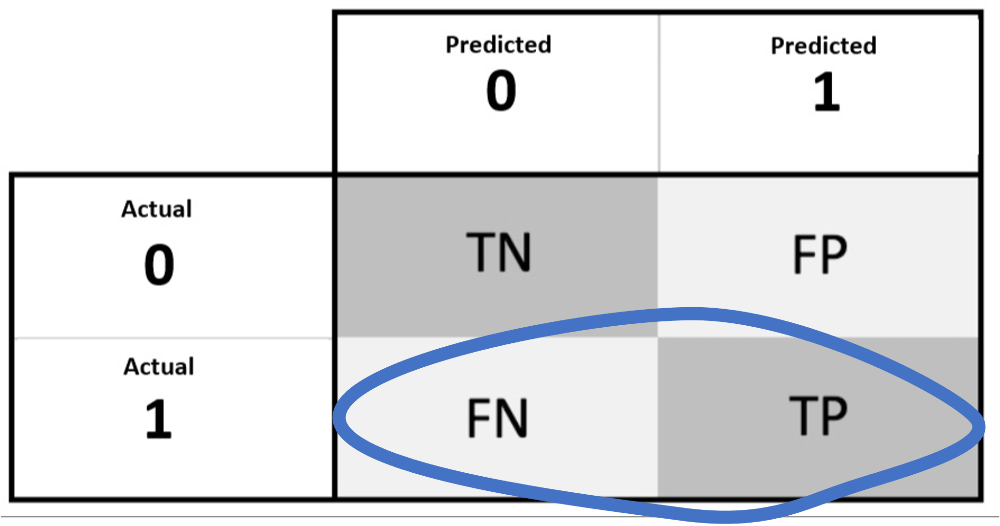

```{r setup, include=FALSE}
knitr::opts_chunk$set(echo = FALSE)
```

## Introduction

For binary classification there are **three** different types of metrics:

1. Threshold
2. Ranking
3. Probability

These different types of metrics have different properties that may or may not be important for a particular application.

## Threshold Metrics

A machine learning model generates a score during prediction:

1. The prediction is the positive class if the score greater than threshold.
2. The prediction is the negative class if the score less than threshold.

The default threshold is 0.5.

## Threshold Metrics

Since the scores have been converted into class predictions a confusion matrix is available from which threshold metrics can be calculated:

- Accuracy
- Precision
- Recall
- F1-Score

## Ranking Metrics

Threshold metrics involved converting scores to class predictions with a threshold. This is not always desirable because different threshold result in different type one and type two errors. Hence, evaluating the model is only evaluating the model for a particular threshold. 

**What happens if you change the threshold?**

## Ranking Metrics

Ranking Metrics are metrics that are threshold independent. There are two types of threshold independent metrics.

1. Ranking metrics only consider the ranking of the scores.
2. Probability metrics consider the ranking and size of the score.

## Ranking Metrics

The two most popular ranking metrics are:

- AUC ROC
- AUC PR

Since, these are ranking metrics they do not change if you scale the scores up or down as long as the order of the scores are the same. 

## Ranking Metrics

Ranking metrics are particularly useful when you are only interested in the top $n$ scores. This is because the top $n$ scores only depend on the rank of the scores not the scale. If the scale is not important they metric does not need to depend on it. 

## Probablity Metrics

Probability metrics consider the ranking and size of the score.

- Probability metrics are good when the scores are calibrated.
- Probability metrics are bad when the scores are not calibrated.

A score is calibrated if it is between zero and one and represents a relative frequency. The scores provided in weather forecasts are calibrated. For example, on all the days the weather forecast said that there was a 10% probability of rain, rain was recoded on 10% of those days. 

## Probability Metrics

The two most popular probability metrics are:

- Brier Score
- Brier Skill Score

A Brier Skill Score is a Brier Score scaled between zero and one. Zero represents random prediction and one represents perfect prediction.

## Metrics

1. Confusion Matrix
2. Accuracy
3. Precision
4. Recall
5. F1-Score

## 1. Confusion Matrix

**Confusion matrix**, $C$ is such that $C_{ij}$ is equal to the number observations known to be in group 
$i$ and predicted to be in group $j$

In binary classification: 

  - $C_{0,0}$ is the count of true negatives (**TN**)
  - $C_{0,1}$ is the count of false positives (**FP**)
  - $C_{1,0}$ is the count of false negatives (**FN**)
  - $C_{1,1}$ is the count of true positives (**TP**)

## 1. Confusion Matrix

{width=100%}

## 1. Confusion Matrix

Consider a `model` and `data` with attributes `target` and `features`. The true targets and predicted targets are computed as:

```
y_true = data.target
y_pred = model(data.features)
```

In python a **confusion matrix** is computed as:

```
from sklearn.metrics import confusion_matrix

(tn, fp), (fn, tp) = confusion_matrix(y_true, y_pred)
```

## 2. Accuracy

**Accuracy** is the number of correctly predicted examples divided by the total number of examples.

It can be expressed as the sum of the diagonal elements of a confusion matrix, divided by the sum of all the elements of a confusion matrix:

$$(TP + TN) \over (TP + FP + TN + FN)$$

## 2. Accuracy

{width=100%}

## 2. Accuracy

In python **accuracy** is computed as:

```
from sklearn.metrics import accuracy_score

(tp + tn) / (tp + fp + tn + fn), accuracy_score(y_true, y_pred)
```

## 3. Precision

**Precision** is the percentage of **positive predictions** (i.e. examples predicted as positive) that are positive examples.

$$\operatorname{Precision} = \frac{TP}{TP + FP}$$

## 3. Precision

{width=100%}

## 3. Precision

In python **precision** is computed as:

```
from sklearn.metrics import precision_score

tp / (tp + fp), precision_score(y_true, y_pred)
```

## 4. Recall

**Recall** the percentage of **positive examples** (i.e. examples that are positive) that are positive predictions.

$$\operatorname{Recall} = \frac{TP}{TP + FN}$$

## 4. Recall

{width=100%}

## 4. Recall

In python **recall** is computed as:

```
from sklearn.metrics import recall_score

tp / (tp + fn), recall_score(y_true, y_pred)
```

## 5. F1 Score

**F1 Score** is the harmonic mean of the precision and recall

$$\operatorname{f1} = 2 \frac{\text{Precision} \times \text{Recall}}{\text{Precision} + \text{Recall}}$$

## 5. F1 Score

In python **f1** is computed as:

```
from sklearn.metrics import f1_score

f1_score(y_true, y_pred)
```
